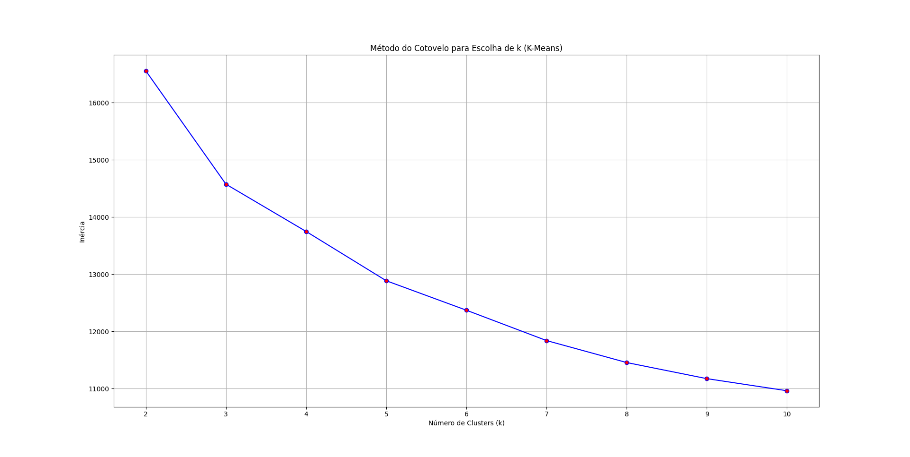
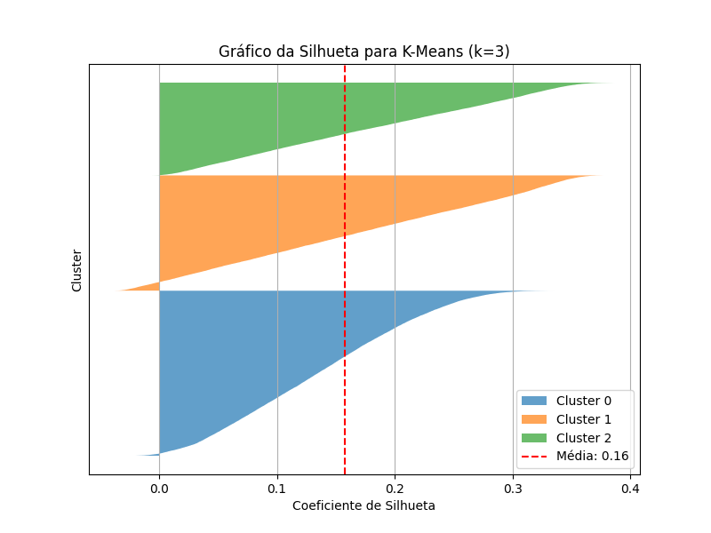
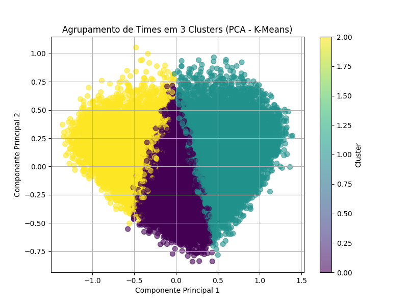
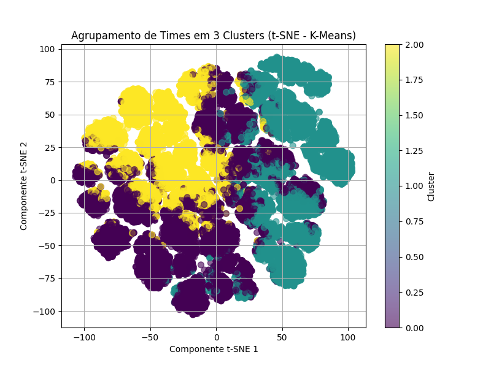

# Agrupamento de Times por Nível de Desempenho

Projeto desenvolvido na disciplina de Inteligência Computacional com o objetivo de aplicar técnicas de aprendizado não supervisionado para agrupar times de League of Legends com base em seu desempenho competitivo.
O projeto utiliza o algoritmo K-Means para identificar padrões e similaridades entre equipes a partir de dados estatísticos.


# 📌 Objetivo do Projeto

O projeto visa analisar dados de desempenho de equipes de League of Legends (LOL) utilizando técnicas de clustering, permitindo identificar grupos de times com características semelhantes.

A proposta envolve:

- Pré-processamento dos dados
- Aplicação do algoritmo K-Means
- Avaliação da qualidade dos clusters
- Visualização dos agrupamentos em gráficos bidimensionais

---

# 📊 Dataset Utilizado

Dataset disponível no Kaggle:

- League of Legends Dataset  
https://www.kaggle.com/datasets/chuckephron/leagueoflegends

---

# ⚙️ Tecnologias e Bibliotecas Utilizadas

O projeto foi desenvolvido em Python utilizando bibliotecas voltadas para ciência de dados e machine learning.

Principais bibliotecas:

```python
pandas
numpy
matplotlib
seaborn
scikit-learn
```

---

# 🔄 Pré-processamento dos Dados

Antes da aplicação do algoritmo, foram realizadas etapas de tratamento dos dados:

- Preenchimento de valores ausentes
- Remoção de outliers
- Normalização dos dados


# 🤖 Algoritmo Utilizado

## K-Means (MiniBatchKMeans)

O algoritmo utilizado foi o MiniBatchKMeans, uma variação do K-Means tradicional otimizada para maior eficiência em conjuntos de dados maiores.

### Configurações principais:

- Critério de convergência: `tol = 1e-4`
- Máximo de iterações: `300`
- Uso de mini-batches para atualização dos centróides


# 📈 Métricas e Avaliações

## Método do Cotovelo

Utilizado para determinar o número ideal de clusters (K).

Métrica utilizada:
- Inércia (soma das distâncias quadradas entre os pontos e os centróides)

### 📷 Método do Cotovelo



---

## Silhouette Score

Avalia a qualidade dos agrupamentos formados.

Interpretação:
- Próximo de `1`: cluster bem definido
- Próximo de `0`: ponto na fronteira entre clusters
- Valor negativo: agrupamento inadequado

### 📷 Gráfico de Silhueta

 

---

# 📉 Redução de Dimensionalidade

Foram utilizadas técnicas para visualização dos clusters em duas dimensões.

## PCA (Principal Component Analysis)

Permite visualizar os dados de alta dimensão.

### 📷 Visualização PCA

 

---

## t-SNE

Utilizado para preservar a proximidade entre os pontos e melhorar a visualização dos agrupamentos.

### 📷 Visualização t-SNE

  
---


# 📌 Resultados Obtidos

O modelo conseguiu identificar agrupamentos de equipes com características semelhantes de desempenho, permitindo visualizar padrões competitivos entre os times analisados.

As métricas e gráficos gerados auxiliaram na validação da qualidade dos clusters encontrados.

---

# 📚 Referências

- https://www.datacamp.com/pt/blog/clustering-in-machine-learning-5-essential-clustering-algorithms
- https://www.datacamp.com/pt/blog/introduction-to-unsupervised-learning
- https://www.kaggle.com/datasets/chuckephron/leagueoflegends

---

# 📄 Licença

Este projeto possui fins acadêmicos e educacionais.
